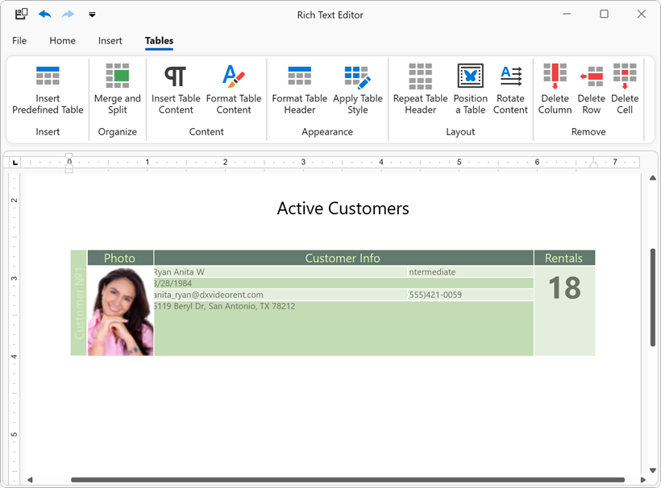

<!-- default badges list -->

<!-- default badges end -->
# DXRichEdit for WPF: Use Table API to Generate a Complex Table

This example shows how to generate a complex table in code from scratch. In this example, the buttons on the **Tables** ribbon tab allows you to execute the following actions:

* Create a table
* Specify table width
* Add new rows and columns
* Merge and split cells
* Insert and format table content
* Change table appearance
* Position a table

## Files to Review

* [MainWindow.xaml](./CS/MainWindow.xaml) (VB: [MainWindow.xaml](./VB/MainWindow.xaml))
* [MainWindow.xaml.cs](./CS/MainWindow.xaml.cs) (VB: [MainWindow.xaml.vb](./VB/MainWindow.xaml.vb))

## Documentation

* [Tables in RichEdit Documents](https://docs.devexpress.com/WPF/9105/controls-and-libraries/rich-text-editor/rich-edit-control-document/tables)
